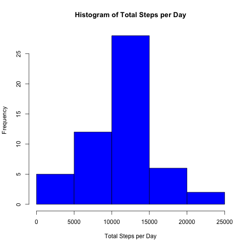
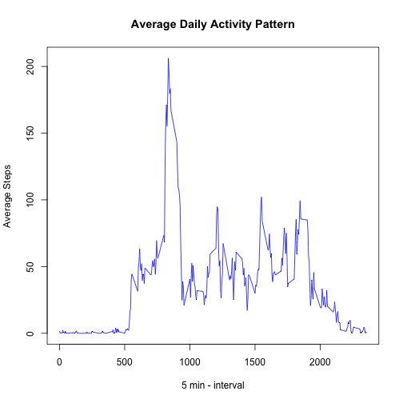
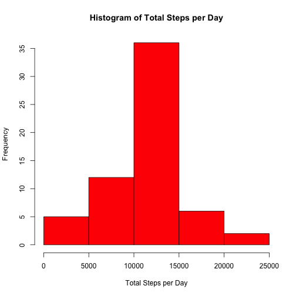
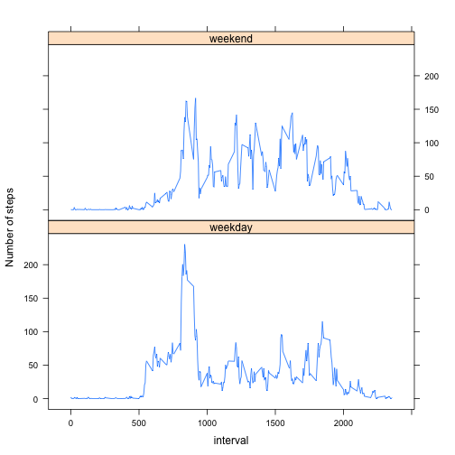

This is the R Markdown document for Peer Assignment 1, Reproducible Research Course.

The first step is to load the data and required packages.
It is important to be sure that you have downloaded the activity file from the course site.


```r
library(dplyr)
activity<-read.csv("activity.csv")
activity<-mutate(activity,date=as.Date(date)) # change date to Date type
```

**What is mean total number of steps taken per day?**

For this part of the assignment, you can ignore the missing values in the dataset.

*NOTE: The na.rm=FALSE in the summarise function will allow to generate NAs in the days where there is no available data. The histogram function will not plot these days.*

```r
# Prepare data to answer the 2 coming questions
newdata <- activity %>%
           group_by(date) %>%  # group by day
           summarise(dailyTotal=sum(steps,na.rm=FALSE))
```


1. Make a histogram of the total number of steps taken each day

```r
hist(newdata$dailyTotal,
     col="blue",
     main="Histogram of Total Steps per Day",
     xlab="Total Steps per Day")
```

 

2. Calculate and report the mean and median total number of steps taken per day

```r
mean(newdata$dailyTotal,na.rm=TRUE)
```

```
## [1] 10766.19
```

```r
median(newdata$dailyTotal,na.rm=TRUE)
```

```
## [1] 10765
```

*NOTE: The mean and median values are very close denoting a centered distribution.*

**What is the average daily activity pattern?**

Make a time series plot (i.e. type = "l") of the 5-minute interval (x-axis) and the average number of steps taken, averaged across all days (y-axis)

```r
newdata <- activity %>%
           group_by(interval) %>%
           summarise(StepsInterval=mean(steps,na.rm=TRUE))
with( newdata, plot(interval,StepsInterval,
                    type="l",
                    col="blue",
                    main="Average Daily Activity Pattern",
                    xlab="5 min - interval",
                    ylab="Average Steps")
   )
```

 

Which 5-minute interval, on average across all the days in the dataset, contains the maximum number of steps?


```r
with(newdata,interval[which.max(StepsInterval)])
```

```
## [1] 835
```

*NOTE: This corresponds to 8:35 AM.*

**Imputing missing values**

Note that there are a number of days/intervals where there are missing values (coded as NA). The presence of missing days may introduce bias into some calculations or summaries of the data.

Calculate and report the total number of missing values in the dataset (i.e. the total number of rows with NAs)

*Are there any missing intervals , dates, and steps?*

*Missing intervals=* 0
*Missing dates=* 0
*Missing steps=* 2304

*Conclusion: only steps are missing.*

Devise a strategy for filling in all of the missing values in the dataset. The strategy does not need to be sophisticated. For example, you could use the mean/median for that day, or the mean for that 5-minute interval, etc.

Create a new dataset that is equal to the original dataset but with the missing data filled in.

*Strategy: NA values will be replaced by the mean value already calculated for the Average Daily Activity Pattern*

```r
newdata<- inner_join(activity, newdata) %>% # every row will contain the average steps for the interval StepsInterval from newdata
          mutate(steps=ifelse(is.na(steps),StepsInterval,steps)) %>%
          select(-StepsInterval) # this will drop the StepsInterval from the dataframe
```

```
## Joining by: "interval"
```

Make a histogram of the total number of steps taken each day and Calculate and report the mean and median total number of steps taken per day. Do these values differ from the estimates from the first part of the assignment? What is the impact of imputing missing data on the estimates of the total daily number of steps?

```r
# summarise and plot data
newdata1 <- newdata %>% group_by(date) %>% summarise(dailyTotal=sum(steps))

hist(newdata1$dailyTotal,
     col="red",
     main="Histogram of Total Steps per Day",
     xlab="Total Steps per Day")
```

 

```r
mean(newdata1$dailyTotal)
```

```
## [1] 10766.19
```

```r
median(newdata1$dailyTotal)
```

```
## [1] 10766.19
```
*Conclusion:Comparing original and modified data*
*There is no significant change in the results: the number of valid samples in the modified data is greater, so the total steps is also greater, but the histogram is very similar in shape, and the mean and median are practily the same*


**Are there differences in activity patterns between weekdays and weekends?**

Create a new factor variable in the dataset with two levels – “weekday” and “weekend” indicating whether a given date is a weekday or weekend day.

*NOTE: I will use wday() from Lubridate package that gives numeric results from 1 (Sun), to 7 (Sat)*

```r
library(lubridate)
newdata<-newdata %>% 
         mutate(day=as.factor(ifelse(wday(date) %in% c(1,7),"weekend","weekday")))
```
Make a panel plot containing a time series plot (i.e. type = "l") of the 5-minute interval (x-axis) and the average number of steps taken, averaged across all weekday days or weekend days (y-axis). See the README file in the GitHub repository to see an example of what this plot should look like using simulated data.

```r
library(lattice)
newdata<- newdata %>% 
          group_by(day,interval) %>%
          summarise(meansteps=mean(steps))
with (newdata, 
      xyplot(meansteps ~ interval|day, type="l", 
             ylab="Number of steps",layout=c(1,2)))
```

 

*CONCLUSION: There is a different pattern of steps for weekdays and weekends. It can be seen that the activity is more spread during the day during the weekends, are more concentrated during weekdays*
